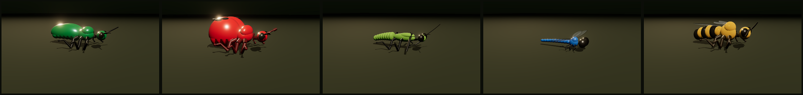

# 🪲 Insects — a parametric bug

### ▸ Live: **[insect.exe.xyz](https://insect.exe.xyz)**

A real-time, biologically-grounded **insect** in Three.js — and the first
**parts + skeleton** rig in the parametric family. Unlike the earlier single-hull
creatures (fish, siphonophore, nudibranch), an insect is an *assembly of parametric
parts posed by a joint hierarchy*: a segmented body (head + thorax + abdomen) carrying
articulated appendages (six jointed legs, wings, antennae). Every real insect is a
point in one parameter space; slide between them and a jewel beetle becomes a
dragonfly becomes a bee.



*Jewel beetle · ladybird · mantis · dragonfly · honeybee — the same rig at different
coordinates, spanning Coleoptera / Mantodea / Odonata / Hymenoptera.*

## Run it

```bash
npm install
npm start        # http://localhost:5188
npm run smoke    # Node: assemble every species, check for NaNs
npm run render   # headless Chromium: screenshot each species
npm run build    # content-hashed dist/
```

## The architecture (parts + skeleton)

This is the framework the shell/crab/spider subjects will reuse. See
`../devlog/20260711-beyond-single-hull-geometry.md` for the strategic note and
`devlog/20260711-insect-morphology-research.md` for the sourced morphology.

```
src/
  core/params.js     THE parameter space: body / legs / wings / antennae / head / surface
  rig/
    limb.js          the ONE jointed-limb primitive — a chain of tapered segments +
                     joints you rotate to pose. Drives legs AND antennae (and later
                     mouthparts / proboscis). The articulated generalisation of the
                     nudibranch's recursive appendage.
    body.js          the segmented body: head + thorax (+ pronotum) + tapering,
                     drooping abdomen; alternate-segment banding (bee/wasp); exposes
                     SOCKETS for the parts assembler.
    wings.js         membrane wing (teardrop + generated venation network) + beetle
                     elytra (curved chitin shells).
    InsectRig.js     the assembler: body + six posed legs (leg-type stances:
                     cursorial / raptorial / saltatorial …) + antennae + compound
                     eyes + wings + ladybird spots.
  shading/InsectMaterial.js  chitin PBR with real thin-film IRIDESCENCE (the structural-
                     colour hero — jewel beetle, Morpho), + finish spectrum
                     (matte / gloss / iridescent / metallic / fuzzy).
  scene/environment.js  a lit macro studio on a terrestrial substrate.
  main.js
```

Key idea: **one jointed-limb primitive** + **sockets on a segmented body** = every
appendage from one reusable part, posed by a skeleton. Colour patterns come from the
parts too (bee bands = alternating segment materials; ladybird spots = placed discs)
rather than a UV shader.

## Status

**Live at [insect.exe.xyz](https://insect.exe.xyz)** (exe.dev VM `insect`, push-to-deploy
autodeploy). Seven species across five orders — jewel beetle, ladybird, mantis,
dragonfly, honeybee, housefly, mosquito — with legs, wings, elytra, venation, banding,
spots, structural iridescence, a projecting proboscis, and **animation**: the
alternating-tripod walking-in-place gait, antennae twitch, head look-at-camera, and fly
foreleg grooming. **Still improving** (see `ROADMAP.md`): tighter per-species body
proportions, the weird ones (treehopper pronotal helmet, beetle horns, stick/leaf
insects), wing pattern layer (butterfly eyespots), and — for the eventual spiders/true
arthropods — a real physics/gait solver.
